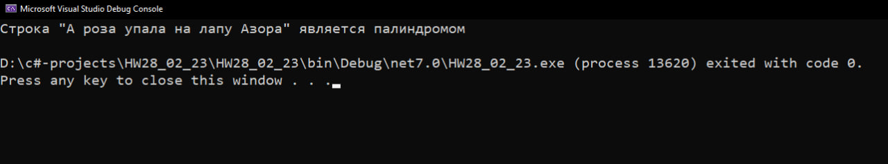
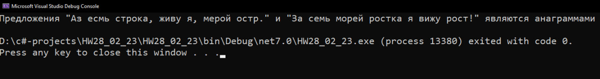
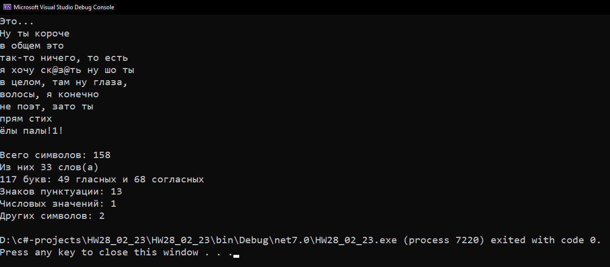

# Дз от 28/02/23. string 
##  **Задание 1.** Дана строка символов. Необходимо проверить, является ли эта строка палиндромом.
```cs
string firstStr = "А роза упала на лапу Азора";
string secondStr = firstStr.ToLower().Replace(" ", ""); // Удаляем все пробелы и уменьшаем капс
string reverseStr = new string(secondStr.ToCharArray().Reverse().ToArray()); // Переворачиваем строку
if (secondStr == reverseStr)
    Console.WriteLine($"Строка \"{firstStr}\" является палиндромом");
else
    Console.WriteLine($"Строка \"{firstStr}\" не является палиндромом");
```
### Результат:

____
##  **Задание 2.** Написать программу, подсчитывающую количество слов, гласных и согласных букв в строке, введёной пользователем. Дополнительно выводить количество знаков пунктуации, цифр и др. символов.
```cs
int countLettersInOffer = 0; // всего символов
int countVowelsInOffer = 0; // гласных
int countConsonantsInOffer = 0; // согласных
int countPunctuationMarks = 0; // знаков пунктуации
int countDigets = 0; // числовых значений
int countEtcSymbols = 0; // других символов
char[] vowelsLetters = { 'а', 'и', 'о', 'у', 'ы', 'я', 'э', 'ю', 'е', 'ё' };

string offer = "Это...\nНу ты короче\nв общем это\nтак-то ничего, то есть\nя хочу ск@з@ть ну шо ты\nв целом, там ну глаза,\nволосы, я конечно\nне поэт, зато ты\nпрям стих\nёлы палы!1!";
Console.WriteLine(offer);

foreach (char symbol in offer)
{ 
    if (Char.IsDigit(symbol)) countDigets++;
    if (Char.IsPunctuation(symbol)) countPunctuationMarks++;
    if ((symbol >= 34 && symbol <= 64 && !Char.IsDigit(symbol)) && symbol != 39 && symbol != 45 && symbol != 46 && symbol != 44) countEtcSymbols++; // проверка что не число, и не один из символов 39 - '`' 44 - ',' 45 - '-' 46 - '.' по таблице ascii
}

string[] words = offer.Replace('\n', ' ').Replace(",", "").Replace(".", "").Replace("-", "").Split(" ");
foreach (string word in words)
{
    countLettersInOffer += word.Length; // подсчет букв
    foreach (char letter in word.ToLower())
    {
        if (vowelsLetters.Contains(letter)) // если массив гласных содержит этот символ
            countVowelsInOffer++;
        else
            countConsonantsInOffer++;
    }
}

Console.WriteLine($"\nВсего символов: {offer.Length}");
Console.WriteLine($"Из них {words.Length} слов(а)");
Console.WriteLine($"{countLettersInOffer} букв: {countVowelsInOffer} гласных и {countConsonantsInOffer} согласных");
Console.WriteLine($"Знаков пунктуации: {countPunctuationMarks}");
Console.WriteLine($"Числовых значений: {countDigets}");
Console.WriteLine($"Других символов: {countEtcSymbols}");
```
### Результат:

____
##  **Задание 3.** Написать программу, проверяющую, является ли одна строка анаграммой для другой строки (строка может состоять из нескольких слов и символов пунктуации).
```cs
string str1 = "Аз есмь строка, живу я, мерой остр.";
string str2 = "За семь морей ростка я вижу рост!";

char[] charStr1 = str1.Replace(",", "").Replace(".", "").Replace("!", "").Replace(" ", "").ToLower().ToCharArray();
char[] charStr2 = str2.Replace(",", "").Replace(".", "").Replace("!", "").Replace(" ", "").ToLower().ToCharArray();

if (charStr1.Length != charStr2.Length)
{
    Console.WriteLine("Предложения имеют разную длину");
    return;
}

Array.Sort(charStr1);
Array.Sort(charStr2);

bool flag = true;
for (int letter = 0; letter < charStr1.Length; letter++)
{
    if (charStr1[letter] != charStr2[letter])
        flag = false;
}

if (!flag)
    Console.WriteLine($"Предложения \"{str1}\" и \"{str2}\" не являются анаграммами");
else
    Console.WriteLine($"Предложения \"{str1}\" и \"{str2}\" являются анаграммами");
```
### Результат:

____